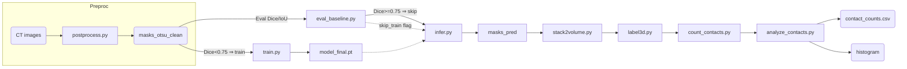

````markdown
# Architecture — **particle-contact** Pipeline

_Goal: build a reproducible, one-command workflow that converts CT slices of furan-mold sand into a 3-D particle volume, labels each particle, counts contacts, and outputs analytics — **追加の手動ラベルなし**で動くことが第一目標。_

---

## 1. Directory & File Layout

```text
particle-contact/
├ data/                     # 📥 インプット＆小規模手動資産
│ ├ images/                 # 196 枚の生 CT PNG
│ ├ masks_otsu/             # 196 枚の Otsu 準教師マスク
│ └ masks_gt/               # 3 枚の手動ラベル（検証用）
│
├ models/                   # 🎛 モデル出力
│ ├ model_last.pt           # 最新チェックポイント
│ └ model_final.pt          # Dice が最高の重み
│
├ output/                   # 📊 パイプライン実行結果
│ └ run_YYYY_MM_DD_HHMM/    # 実行ごとに自動生成
│    ├ masks_pred/          # 後処理済み 2-D マスク
│    ├ volume.npy           # 3-D bool または label 配列
│    ├ contact_counts.csv   # 粒子ごとの接点数
│    ├ contacts_summary.csv # 平均・中央値など
│    ├ hist_contacts.png    # 接点分布ヒストグラム
│    └ logs/                # TensorBoard／テキストログ
│
├ src/                      # 🧠 パイプライン・コード
│ ├ postprocess.py          # Otsu＋モルフォ後処理関数
│ ├ eval_baseline.py        # 3 枚で Dice/IoU 評価
│ ├ dataset.py              # PatchDataset＋augment
│ ├ train.py                # 転移学習 U-Net Trainer
│ ├ infer.py                # 一括推論＋後処理
│ ├ stack2volume.py         # 2-D → 3-D 変換
│ ├ label3d.py              # 3-D ラベリング
│ ├ count_contacts.py       # 接点数計算
│ ├ analyze_contacts.py     # 集計 & 図表生成
│ └ pipeline.py             # 🔑 ワンコマンド統括
│
├ requirements.txt          # ライブラリ固定
├ README.md                 # 起動手順
└ architecture.md           # ← このドキュメント
```
````

---

## 2. Component Roles

| コンポーネント          | 主な責務                                                                                        |
| ----------------------- | ----------------------------------------------------------------------------------------------- |
| **postprocess.py**      | CLAHE → GaussianBlur → Otsu → binary_closing → remove_small_objects(≥50px) でマスクを綺麗にする |
| **eval_baseline.py**    | 後処理 Otsu マスク vs 手動 3 枚で Dice / IoU を算出し、学習が必要か判定                         |
| **dataset.py**          | 256×256 パッチ化＋回転・反転・輝度 Augmentation を定義                                          |
| **train.py**            | ResNet34-Encoder U-Net を Dice+BCE Loss で短期学習（必要時のみ）                                |
| **infer.py**            | 196 枚全てを推論し、`masks_pred/` に保存                                                        |
| **stack2volume.py**     | スライス順に Bool Volume を積層 (`volume.npy`)                                                  |
| **label3d.py**          | `skimage.measure.label` で 3-D 粒子 ID を付与                                                   |
| **count_contacts.py**   | 26 近傍で異なる ID を数え、`contact_counts.csv` 出力                                            |
| **analyze_contacts.py** | 平均・中央値計算、ヒストグラム画像/CSV を生成                                                   |
| **pipeline.py**         | CLI で全工程を順番に呼び出し、タイムスタンプ付き `output/` を作る                               |

---

## 3. State Management

| 種類              | 保存場所               | 説明                                     |
| ----------------- | ---------------------- | ---------------------------------------- |
| 原始 CT           | `data/images/`         | 読み取り専用                             |
| 準教師マスク      | `data/masks_otsu/`     | 読み取り専用、学習 & 推論ベース          |
| 手動 GT           | `data/masks_gt/`       | 小テスト用、読込のみ                     |
| モデル重み        | `models/*.pt`          | `train.py` が書き込み、`infer.py` が読込 |
| 中間マスク        | `output/*/masks_pred/` | 推論後〜3-D 化まで使用                   |
| 3-D ボリューム    | `output/*/volume.npy`  | ラベリング & 接点計算で読込              |
| ログ & メトリクス | `output/*/logs/`       | TensorBoard 用                           |
| 最終 CSV / 図     | `output/*/*.csv/png`   | レポート提出物                           |

_外部 DB やメッセージキューなし — すべて **ファイル依存** で移植性 ◎。_

---

## 4. Module Interaction (Service Flow)



_全ステップを **pipeline.py** が順次呼び出し、失敗時は途中終了ログを残す。_

---

## 5. 依存ライブラリ（最小）

```text
torch>=2.2
segmentation_models_pytorch
albumentations
opencv-python
scikit-image
scipy
numpy
pandas
matplotlib
tqdm
tensorboard
```

---

## 6. 実行例

### (1) 学習スキップで即パイプライン

```bash
python src/pipeline.py \
  --img_dir data/images \
  --mask_dir data/masks_otsu \
  --skip_train \
  --out_dir output/baseline_$(date +%Y%m%d_%H%M)
```

### (2) Dice が低かった場合に学習を有効化

```bash
python src/pipeline.py \
  --img_dir data/images \
  --mask_dir data/masks_otsu \
  --gt_dir  data/masks_gt \
  --epochs 30 \
  --batch_size 16 \
  --out_dir output/train_$(date +%Y%m%d_%H%M)
```

---
